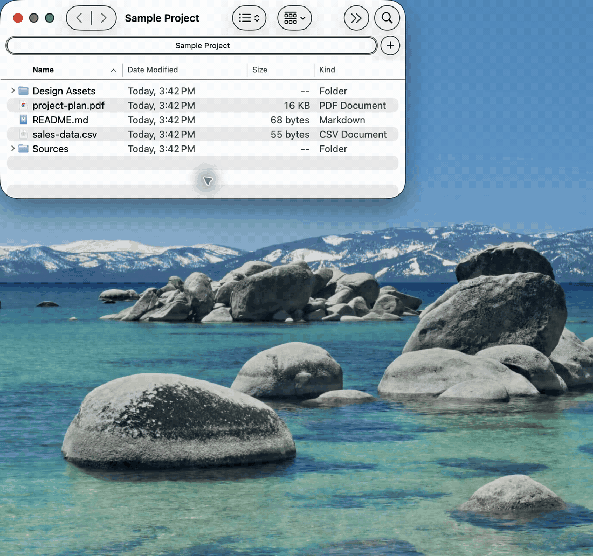

# Copy Path As

[](https://github.com/vfedoroff/copypathas/releases/latest) [](#requirements) [](https://www.swift.org/) [](LICENSE)

Copy Path As adds path-copying commands to the Finder context menu. Select one or more files or folders, right-click, and choose the format you need.

## See It in Action



## Available Formats

| Format | Example |
| --- | --- |
| Path | `/Users/me/Projects/main.swift` |
| Quoted Path | `"/Users/me/My Project/main.swift"` |
| Shell-Escaped Path | `/Users/me/My\ Project/main.swift` |
| File URL | `file:///Users/me/Projects/main.swift` |
| Filename | `main.swift` |
| Filename Without Extension | `main` |
| Parent Folder | `/Users/me/Projects` |
| JSON Array | `["/Users/me/Projects/main.swift"]` |
| Markdown Link | `[main.swift](file:///Users/me/Projects/main.swift)` |

For multiple selections, JSON Array produces one JSON array. Other formats produce one value per line in Finder's selection order.

## Requirements

- macOS 15 or later
- Permission to enable Finder extensions in System Settings

## Install

### Homebrew (Recommended)

You can install Copy Path As via Homebrew:

```bash
brew install --cask vfedoroff/tap/copypathas
```

### Manual

1. Download the latest `.dmg` or `.zip` from [GitHub Releases](https://github.com/vfedoroff/copypathas/releases/latest).
2. Move `CopyPathAs.app` to `/Applications`.
3. Open Copy Path As once.
4. Select **Open Finder Extension Settings**.
5. In System Settings, enable **Copy Path As** under **General → Login Items & Extensions → Finder Extensions**.

Releases are currently ad-hoc signed rather than notarized. If macOS blocks the first launch, Control-click the app in Finder, choose **Open**, and confirm that you want to open it. Only use builds downloaded from this repository's release page.

## Use

1. Select one or more files or folders in Finder.
2. Right-click the selection.
3. Open **Copy Path As**.
4. Choose a format. The result is copied to the clipboard.

Once enabled, macOS loads the Finder extension automatically when Finder starts. Copy Path As does not need to remain open or be configured as a login item.

## Troubleshooting

If **Copy Path As** is missing from Finder's context menu:

1. Open Copy Path As and confirm that it reports the extension as enabled.
2. Use **Open Finder Extension Settings** and verify the extension is enabled.
3. Relaunch Finder by logging out and back in, or by holding Option while right-clicking Finder in the Dock and choosing **Relaunch**.
4. Confirm that the app remains installed at a stable location such as `/Applications`.

The extension works independently from the settings app. Reopening the app is useful for checking authorization, but leaving it running does not make the Finder extension more reliable.

## Privacy and Security

The app and extension are sandboxed. Copy Path As formats file URLs supplied by Finder in memory; it does not read file contents, access the network, or collect telemetry.

## Contributing

Source builds, architecture notes, test workflows, and debugging instructions are in [CONTRIBUTING.md](CONTRIBUTING.md).

## License

Copy Path As is available under the [MIT License](LICENSE).
